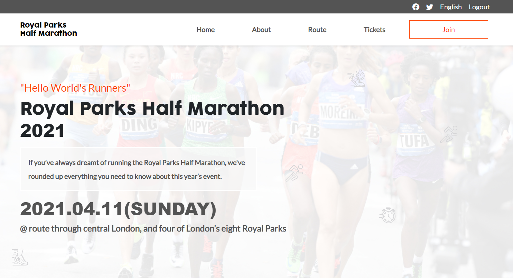

# Royal Parks Half Marathon

This website is to announce the coming Royal Parks Half Marathon and contains four main pages home, about, route, and tickets pages.
The project makes use of HTML5, Bootstrap, and Sass.

## Built With

- HTML5 , CSS3 , Bootstrap
- Windows, Linux

## Live Demo

[Live Demo Link]( https://maha-magdy.github.io/Royal-Parks-Half-Marathon/ )

## Loom Video
[Loom Video Link](https://www.loom.com/share/bc56eddb747242a7961e1519d01c862a)

## Getting Started

**To get a local copy up and running follow these simple steps.**

### Prerequisites

-Windows, Mac or Linux machine 
-Web browser other than Internet Explorer

### Setup

-Download all the files to the same folder and run index.html

-To clone this repo run this code on a terminal window: 

git clone https://github.com/Maha-Magdy/Royal-Parks-Half-Marathon.git

### Install

-No instalation required

### Deployment

-You can deploy this project forking it on GitHub and then going to:
->Repository
->Settings
->GitHub Pages => Select source
->Save

The project will be deployed to https://yourgithubusername.github.io/repositorysname/

## Author

👤 **Maha Magdy**

- GitHub: [Maha-Magdy](https://github.com/Maha-Magdy)
- Twitter: [@Maha_M_Abdelaal](https://twitter.com/Maha_M_Abdelaal)
- LinkedIn: [Maha Magdy](https://www.linkedin.com/in/maha-magdy-18a8a7116/)

## 🤝 Contributing

Contributions, issues, and feature requests are welcome!

Feel free to check the [issues page]( https://github.com/Maha-Magdy/Royal-Parks-Half-Marathon/issues ).

## Show your support

Give a ⭐️ if you like this project!

## Acknowledgments

- [The orginal article that I took most of the information about the marathon](https://www.runnersworld.com/uk/events/a25988769/royal-parks-half-marathon/#)
- [Bootstrap](https://getbootstrap.com/)
- [Flaticon](https://www.flaticon.com/)
- [A credit of the design that has been followed on Behance](https://www.behance.net/gallery/29845175/CC-Global-Summit-2015)

## 📝 License

This project is [MIT](./LICENSE) licensed.

